# Инкрементальный streaming runtime для Voxtral Mini Realtime — архитектурный проект

**Статус:** проектный документ (design). Streaming ещё не реализован. Baseline —
commit `283188f chore: establish Vulkan inference baseline`.
**Дата:** 2026-07-21. **Целевой backend:** Vulkan/RADV (AMD Radeon RX 6600, 8 GB).
**Цель документа:** дать следующему агенту достаточное описание, чтобы реализовать
streaming runtime без повторного исследования всей кодовой базы.

Этот документ — единственный основной архитектурный документ. Все ссылки на код
даны на файлы и строки актуального дерева на указанном коммите.

---

## 0. Легенда достоверности

Каждое нетривиальное утверждение помечено уровнем достоверности:

| Метка | Значение |
| --- | --- |
| ✅ **SRC** | Подтверждено исходным кодом текущего форка (даны file:line). |
| 🧪 **EXP** | Подтверждено runtime-экспериментом в этой сессии (Vulkan, RX 6600). |
| 🔍 **INF** | Выведено из дизайна модели / конвертера / внешних материалов Voxtral Realtime. |
| ❓ **HYP** | Гипотеза, требует реализации или отдельного эксперимента. |

Единицы: `MB` — десятичные (10⁶ байт), как в логах рантайма (`ggml_nbytes / 1e6`).

---

## 1. Резюме для занятых

- Realtime-модель **кадрово-синхронна**: декодер выдаёт ровно **один токен на один
  аудио-токен = 80 мс** аудио. В батч-коде это цикл `for pos = L … n_audio`
  (`src/voxtral.cpp:2759`), где `position == audio_pos` на каждом шаге
  (`src/voxtral.cpp:2734`, `2764`). ✅ SRC / 🧪 EXP
- Декодер **не имеет cross-attention**. Аудио входит **аддитивно** в input-эмбеддинг:
  `x = tok_emb + audio_emb` (`src/voxtral.cpp:1871`, `1951`). «Cross-attention memory»
  из ТЗ в этой модели физически отсутствует; её роль играет тензор `decoder_memory`
  (выход адаптера), выбираемый по позиции. ✅ SRC
- Энкодер realtime — **причинный со скользящим окном 750 enc-кадров** (≈15 с);
  маска строится в `src/voxtral.cpp:2174-2185`, окно `VOXTRAL_ENC_WINDOW`
  (`include/voxtral.h:28`). Именно это делает возможным chunk-инвариантный streaming
  энкодера. ✅ SRC
- Задержка транскрипции **≈480 мс** встроена в модель (6 delay-токенов), а не в
  рантайм. Это и есть минимально достижимая латентность стриминга. 🔍 INF (конвертер
  `tools/convert_voxtral_to_gguf.py:726-732`)
- Доминирующая per-stream память — **decoder KV-cache 1744.83 MB (F32)** при окне 8192.
  Веса модели (shared) — 2895.20 MB. 🧪 EXP
- `kv_cache_shift_left()` (`src/voxtral.cpp:1232-1261`) всё ещё делает **host-доступ к
  device-памяти** — тот же класс бага, что был исправлен в `clear_kv_cache()`. Путь не
  достигается на клипах <~10.9 мин, поэтому не проверен на Vulkan. ✅ SRC
- **Рекомендация v1:** одна `voxtral_model` (immutable, shared) + N ×
  `voxtral_stream` (mutable) + **один выделенный inference-worker** на модель,
  round-robin по стримам. KV в **F16** для многопоточности. См. §3, §7, §9, §10.

---

## 2. Этап 1 — полная трассировка текущего inference

### 2.1 Точки входа

```
main() [src/main.cpp:381]
 ├─ parse_args()                                  [main.cpp:269]
 ├─ voxtral_model_load_from_file()                [voxtral.cpp:742]   → voxtral_model*
 ├─ voxtral_init_from_model()                     [voxtral.cpp:1038]  → voxtral_context*
 ├─ voxtral_transcribe_file()                     [voxtral.cpp:2797]
 │    ├─ load_wav_file()                          [voxtral.cpp:434]
 │    └─ voxtral_transcribe_from_audio()          [voxtral.cpp:2643]
 ├─ (печать text/tokens, dump-*)                  [main.cpp:444-506]
 ├─ voxtral_free()                                [voxtral.cpp:1200]
 └─ voxtral_model_free()                          [voxtral.cpp:1025]
```

Публичный C++ API объявлен в `include/voxtral.h:130-153`: `voxtral_model_load_from_file`,
`voxtral_model_free`, `voxtral_init_from_model`, `voxtral_free`,
`voxtral_transcribe_file`, `voxtral_transcribe_audio`. ✅ SRC

### 2.2 Реалтайм-путь (интересующий нас), `voxtral_transcribe_from_audio` [voxtral.cpp:2643]

Ветвление offline/realtime — на `ctx.model->hp.is_offline` (`voxtral.cpp:2666`).
Ниже — realtime-ветка (модель `voxtral_realtime`).

```mermaid
flowchart TD
    A["CLI --audio file.wav"] --> B["load_wav_file()\nvoxtral.cpp:434\nWAV→float mono, БЕЗ ресемпла/валидации 16k"]
    B --> C["voxtral_transcribe_from_audio()\nvoxtral.cpp:2643"]
    C --> D["pad_audio_streaming\nvoxtral.cpp:2670-2680\nleft=32 tok, right=17 tok, align→1280"]
    D --> E["compute_mel_even()\nvoxtral.cpp:2525 → compute_mel_spectrogram() 538\nCPU STFT, 128 mel, hop160/win400, чётное число кадров"]
    E --> F["run_encoder_chunked()\nvoxtral.cpp:2229\nокно 3000 mel, шаг 1500, overlap 750 enc-tok"]
    F --> F1["run_encoder_chunk() ×N\nvoxtral.cpp:2113 → build_encoder_graph() 1463\nconv-стем + 32 causal-window слоя → encoder_chunk_output"]
    F1 --> F2["device→CPU→device копия валидной части\nvoxtral.cpp:2314-2323 → encoder_output"]
    F2 --> G["run_adapter()\nvoxtral.cpp:2343 → build_adapter_graph() 1658\nреshape ×4 + Linear-GELU-Linear → decoder_memory"]
    G --> H["prompt: BOS + STREAMING_PAD×(32+6)\nvoxtral.cpp:2704-2710  (L=39)"]
    H --> I["clear_kv_cache()\nvoxtral.cpp:2720"]
    I --> J["run_decoder_prefill(L-1)\nvoxtral.cpp:2391 → build_decoder_prefill_graph() 1839"]
    J --> K["run_decoder_step(prompt[L-1])\nvoxtral.cpp:2734  (первый токен + full logits)"]
    K --> L["ЦИКЛ pos=L..n_audio-1\nvoxtral.cpp:2759\nrun_decoder_step(token,pos,pos) → argmax (4 байта)"]
    L --> M["decode_tokens()\nvoxtral.cpp:389  Tekken b64 → UTF-8"]
    M --> N["voxtral_result{text, tokens, first_step_logits}"]
```



🧪 EXP (3.58 с клип, Vulkan): `padded audio: 120320 samples (left=40960,right=22080)`
→ `mel: 752 frames` → `enc_seq_used=376` → `dec_seq_len=94` → prefill 38 → decode 55
шагов → 56 токенов. Подтверждает 12.5 токенов/с и тождество `n_audio == dec_seq_len`.

### 2.3 Пофункциональная карта (назначение / вход / выход / буферы / lifetime)

| Функция (file:line) | Назначение | Вход | Выход | Создаёт буфер | Переиспользует | Backend хранения | Класс данных |
| --- | --- | --- | --- | --- | --- | --- | --- |
| `load_wav_file` (434) | WAV→mono f32 | путь | `vector<float>` | CPU vector | — | CPU | per-utterance |
| `compute_mel_spectrogram` (538) | STFT+mel | PCM | mel `[128,frames]` | CPU vector | `stft_plan` (static), `hann`,`mel_filters_cpu` | CPU | per-utterance (mel), model-wide (планы) |
| `compute_mel_even` (2525) | mel + чётное # кадров | PCM | mel, n_frames | CPU vector | — | CPU | per-utterance |
| `run_encoder_chunked` (2229) | энкодер по чанкам | mel | заполняет `encoder_output` | `encoder_output` (device, per-utt) | `encoder_chunk_output`, `sched_encoder` | GPU | per-utterance |
| `run_encoder_chunk` (2113) | 1 чанк энкодера | mel-срез, rope_offset | `encoder_chunk_output` | графовый `gctx` (эфемерн.) | `sched_encoder` | GPU | эфемерное |
| `build_encoder_graph` (1463) | граф энкодера | mel-срез | cgraph | входы mel/pos/mask | веса модели | GPU | эфемерное |
| `run_adapter` (2343) | downsample+proj | `encoder_output` | `decoder_memory` | `decoder_memory` (device, per-utt) | `sched_adapter` | GPU | per-utterance |
| `run_decoder_prefill` (2391) | префилл промпта | token_ids | logits + KV[0..L-2] | графовый `gctx` | KV, `decoder_logits`, `sched_dec_pre` | GPU | per-utterance пишет в per-stream KV |
| `run_decoder_step` (2433) | 1 токен | token,pos,audio_pos | argmax/logits + KV[pos] | графовый `gctx` | KV, `decoder_argmax`, `sched_dec_step` | GPU | инкремент per-stream KV |
| `decode_tokens` (389) | детокенизация | ids | UTF-8 | — | `tokenizer_bytes_cache` (mutable!) | CPU | model-wide кэш |

### 2.4 Что уже сейчас можно сохранять между чанками, а что требует полного utterance

| Операция | Требует полный utterance сейчас? | Причина / возможность инкремента |
| --- | --- | --- |
| WAV load | нет | тривиально стримится (PCM chunk) |
| Mel STFT | нет по сути, да по коду | окно 400/hop 160 — нужен left-остаток PCM; сейчас считается по всему буферу (`compute_mel_even`) ✅ SRC |
| Энкодер | нет (причинный, окно 750) | chunk-инвариантен: enc-кадр зависит от ≤750 предыдущих ✅ SRC |
| Адаптер | нет | зависит только от групп по 4 enc-кадра; нужен остаток 0..3 ✅ SRC |
| Декодер | нет | кадрово-синхронный, KV-cache уже инкрементальный ✅ SRC |
| Детокенизация | нет | потоковая по токенам, тривиально |
| `left/right pad` | да (сейчас) | паддинг применяется к целому буферу `voxtral.cpp:2670`; для стрима left-pad — единожды в начале, right-pad — только на `finish()` |

**Вывод этапа 1:** батч-пайплайн уже внутренне состоит из инкрементальных примитивов
(`run_encoder_chunk`, `run_adapter`, `run_decoder_step`), которые оркестрируются
поверх полного utterance. Streaming — это переоркестрация тех же примитивов с
переносом «полноутверанс»-предположений в per-stream состояние.

---

## 3. Этап 2 — инвентаризация структур и состояния

### 3.1 `voxtral_model` [voxtral.cpp:130-169] + `voxtral_hparams` [90-128]

**Immutable/shared после загрузки.** Владеет всеми весами и метаданными.

| Поле | Владелец | Lifetime | Backend | Mutable | Класс | Нужно между feed | Reset | Thread-safety |
| --- | --- | --- | --- | --- | --- | --- | --- | --- |
| `hp` (hparams) | model | весь процесс | — | нет | per-model | n/a | никогда | безопасно (RO) |
| `enc_conv0/1_*`, `enc_layers[]`, `enc_norm_*`, `enc_pos_embedding` | model | процесс | weights buf | нет | per-model | да (RO) | никогда | безопасно (RO) |
| `adapter_0/2_weight` | model | процесс | weights buf | нет | per-model | да (RO) | никогда | безопасно |
| `tok_embeddings_weight`, `dec_layers[]`, `dec_norm_weight`, `output_weight` | model | процесс | weights buf | нет | per-model | да (RO) | никогда | безопасно |
| `mel_filters` | model | процесс | weights buf | нет | per-model | да (RO) | никогда | безопасно |
| `tokenizer_*_b64`, `special_ranks`, `num_special_tokens` | model | процесс | CPU | нет | per-model | да (RO) | никогда | безопасно (RO) |
| **`tokenizer_bytes_cache`** (`:160`) | model | процесс | CPU | **ДА (mutable, lazy)** | per-model | да | никогда | ⚠️ **гонка при N стримах** |
| `ctx_gguf`, `gguf_ctx`, `buf_weights`, `backend_weights` | model | процесс | mixed | нет (после load) | per-model | да | никогда | безопасно |
| `weights_on_gpu`, `gpu_type` | model | процесс | — | нет | per-model | — | — | безопасно |

⚠️ **Единственная mutable-точка в model** — `tokenizer_bytes_cache` (lazy-декод b64→bytes
в `token_bytes_for_id` `voxtral.cpp:366`). При нескольких стримах требует mutex, либо
предзаполнения на старте, либо per-stream кэша. ✅ SRC

### 3.2 `voxtral_context` [voxtral.cpp:175-229] — текущий «всё сразу»

Сегодня это **и device/backend, и per-stream состояние**. В streaming его нужно
расщепить (см. §4). Классификация полей:

| Поле (:line) | Lifetime | Backend | Mutable | Класс в streaming | Нужно между feed | Reset semantics |
| --- | --- | --- | --- | --- | --- | --- |
| `model` (176) | ctx | — | нет | ссылка | да | — |
| `log_level`,`logger`,`n_threads` (177-179) | ctx | — | нет | shared/config | да | — |
| `backend` (182) | ctx | GPU | handle | **device-wide (shared)** | да | никогда |
| `backend_cpu` (183) | ctx | CPU | handle | **device-wide (shared)** | да | никогда |
| `blas_backend` (184) | ctx | CPU/ACCEL | handle | **device-wide (shared)** | да | никогда |
| `gpu_type` (185) | ctx | — | нет | shared | да | — |
| `ctx_persistent`,`buf_persistent` (188-189) | ctx | GPU | нет | **per-stream** | да | никогда |
| `encoder_chunk_output` (192) | ctx | GPU | да | **scratch (может быть shared при сериализации)** | нет | перезап. каждый чанк |
| `decoder_logits` (193) | ctx | GPU | да | scratch/per-stream | нет | перезап. каждый шаг |
| `decoder_argmax` (194) | ctx | GPU | да | scratch/per-stream | нет | перезап. |
| **`kv_self_k`,`kv_self_v`** (197-198) | ctx | GPU | **ДА** | **per-stream (критично)** | **ДА** | `clear_kv_cache` |
| `ctx_enc_full`,`buf_enc_full`,`encoder_output` (201-203) | per-utt | GPU | да | per-stream (переосмыслить) | частично | realloc per utt |
| `total_enc_tokens` (204) | per-utt | — | да | per-stream | да | — |
| `ctx_dec_mem`,`buf_dec_mem`,`decoder_memory` (207-209) | per-utt | GPU | да | **per-stream (ring/append)** | **ДА** | realloc per utt |
| `enc_seq_len`,`enc_seq_used`,`dec_seq_len` (212-214) | per-utt | — | да | per-stream | да | обнуляются |
| **`kv_used`** (217) | per-utt | — | **ДА** | **per-stream (критично)** | **ДА** | =0 при clear |
| `sched_encoder/adapter/dec_pre/dec_step` (220-223) | ctx | mixed | да | **per-stream ИЛИ shared+mutex** | да | `sched_reset` |
| `hann_window` (226) | ctx | CPU | нет | **model-wide (детерминирован)** | да | никогда |
| `mel_filters_cpu` (227) | ctx | CPU | нет | **model-wide** | да | никогда |
| `time_emb_cpu` (228) | ctx | CPU | нет | **model-wide** (t=6 фикс.) | да | никогда |

### 3.3 KV-cache — точная раскладка ✅ SRC / 🧪 EXP

Аллокация: `voxtral.cpp:1126-1136`.
```
kv_self_k, kv_self_v : GGML_TYPE_F32, форма [kv_dim, DEC_WINDOW, dec_layers]
kv_dim     = dec_kv_heads(8) * dec_head_dim(128) = 1024
DEC_WINDOW = 8192                                   (include/voxtral.h:39)
dec_layers = 26  (realtime)
Размер каждого = 1024*8192*26*4 = 872 415 232 B
K+V            = 1 744 830 464 B = 1744.83 MB       (🧪 EXP: лог «kv_cache=1744.83 MB»)
```
- Индексация записи: `build_decoder_layer` `voxtral.cpp:1753-1765` — view по слою
  `layer_idx*nb[2]` и по позиции `kv_offset*nb[1]`. ✅ SRC
- Чтение: `k_full/v_full` — view `[kv_dim, n_kv]`, `n_kv = kv_offset + n_tokens`
  (`voxtral.cpp:1767-1776`). ✅ SRC
- Шаг декодера **без маски** (`attn_mask=nullptr`, `voxtral.cpp:1956`): единственный
  запрос — на последней позиции, все KV — прошлое, каузальность соблюдается
  автоматически. Скользящее окно в декодере **не применяется**
  (`voxtral.decoder.sliding_window = 0`, конвертер `:745,766`). ✅ SRC
- `kv_used` (`:217`) — сколько токенов реально в кэше; растёт на 1 за шаг
  (`voxtral.cpp:2466`), выставляется в префилле (`:2423`). ✅ SRC

---

## 4. Этап 3 — разделение model-state и stream-state

### 4.1 Целевая декомпозиция (логическая; ABI пока не финализируем)

```
voxtral_model        (immutable, shared, 1 экземпляр)
  ├─ hparams, все веса (buf_weights, backend_weights)
  ├─ tokenizer (b64 vocab, special ranks)          + mutex/preheat для bytes_cache
  ├─ mel_filters, hann_window, time_emb (t=6)       ← вынести из context (детерминированы)
  └─ gpu_type / выбор устройства

voxtral_device       (shared, 1 на модель; сейчас «размазан» по context)
  ├─ backend (GPU), backend_cpu, blas_backend
  └─ (опц.) mutex графового исполнения

voxtral_stream       (mutable, N экземпляров)
  ├─ PCM ring + mel-остаток + conv-состояние (incremental frontend, §6)
  ├─ encoder rolling context (окно ~750 enc / ~1500 mel) или encoder KV-cache
  ├─ adapter remainder (0..3 enc-кадра)
  ├─ decoder KV-cache (kv_self_k/v, kv_used)         ← ГЛАВНОЕ per-stream состояние
  ├─ decoder_memory (ring аудио-эмбеддингов) + audio_pos
  ├─ token history + позиции + timestamps
  ├─ event queue (§8), partial transcript
  ├─ состояние ЖЦ (§4.3) + finish/cancel/error
  └─ per-stream schedulers ИЛИ доступ к shared worker (§9)
```

### 4.2 Обязательные решения (с обоснованием)

1. **Может ли одна `voxtral_model` обслуживать несколько streams?**
   ✅ Да. Все веса RO. Единственное исключение — `tokenizer_bytes_cache` (§3.1):
   защитить mutex или предзаполнить. Backend Vulkan один на устройство — сабмиты
   сериализуются воркером (§9). 🔍 INF

2. **Какие GGML backend-буферы можно делить?** `buf_weights` (RO) — делится всегда.
   `buf_persistent` (KV, scratch) — **нельзя делить** (KV мутируется per-stream);
   `encoder_chunk_output`/`decoder_logits`/`decoder_argmax` — scratch, делимы только
   при строгой сериализации исполнения (один воркер). ✅ SRC / 🔍 INF

3. **Можно ли делить scheduler?** `ggml_backend_sched_t` держит внутренние
   compute-буферы и состояние аллокации; **не потокобезопасен**. Вариант A: per-stream
   schedulers (проще, но ×N compute-память). Вариант B: shared schedulers + один
   воркер + `sched_reset` между стримами (меньше памяти). Для v1 — **B**. 🔍 INF

4. **Нужен ли mutex вокруг graph execution?** При одном воркере (v1) — нет (сериализация
   естественная). При нескольких воркерах на один backend — **да**. 🔍 INF

5. **Какие буферы создаются один раз на stream?** KV-cache (`kv_self_k/v`),
   `decoder_memory` ring, encoder rolling/KV, PCM/mel state, event queue. ✅ SRC

6. **Какие могут быть model-wide?** Веса, `mel_filters`, `hann_window`, `time_emb`
   (t=6 фикс., `voxtral.cpp:1194`), STFT-планы (`get_stft_plan` static `:518`). ✅ SRC

7. **Что при уничтожении модели раньше стримов?** Сейчас контракта нет. Требуется:
   либо **строгий контракт** (все стримы уничтожаются до модели), либо
   **refcount** на модели. Рекомендация v1 — строгий контракт + assert в debug. ❓ HYP

8. **Refcount или контракт lifetime?** Для v1 — **явный контракт**
   (`stream ⊂ model ⊂ device`), refcount отложить до C API/WebSocket-сессии. 🔍 INF

---

## 5. Этап 4 — жизненный цикл стрима (state machine)

Внутренний ЖЦ (публичный ABI отдельной сессией). Ориентир функций:
`stream_create / feed / poll / finish / cancel / reset / destroy`.

### 5.1 Состояния

```
CREATED     — объект создан, KV не инициализирован
CONFIGURED  — параметры заданы, KV очищен, промпт-префилл выполнен (BOS+pad), audio_pos=L
RUNNING     — принимает feed(), эмитит токены/partial
FINISHING   — вход закрыт, идёт flush хвоста (эквивалент right-pad, §6)
COMPLETED   — выдан FINAL_TEXT + COMPLETED
CANCELLED   — отменён пользователем
FAILED      — ошибка backend/формата
DESTROYED   — ресурсы освобождены
```

### 5.2 Таблица переходов

| Из \ Событие | create | configure | feed | poll | finish | cancel | reset | destroy | error |
| --- | --- | --- | --- | --- | --- | --- | --- | --- | --- |
| — | CREATED | — | — | — | — | — | — | — | — |
| CREATED | — | CONFIGURED | ⚠️→auto-configure | ok(пусто) | ⚠️→COMPLETED(пусто) | CANCELLED | — | DESTROYED | FAILED |
| CONFIGURED | — | CONFIGURED | RUNNING | ok(пусто) | FINISHING | CANCELLED | CONFIGURED | DESTROYED | FAILED |
| RUNNING | — | ❌ | RUNNING | ok(события) | FINISHING | CANCELLED | CONFIGURED | DESTROYED | FAILED |
| FINISHING | — | ❌ | ❌ | ok(события) | ⚠️idempotent | CANCELLED | CONFIGURED | DESTROYED | FAILED |
| COMPLETED | — | ❌ | ❌ | ok(хвост) | ⚠️no-op | ❌ | CONFIGURED | DESTROYED | — |
| CANCELLED | — | ❌ | ❌ | ok(хвост) | no-op | no-op | CONFIGURED | DESTROYED | — |
| FAILED | — | ❌ | ❌ | ok(ERROR) | no-op | no-op | CONFIGURED | DESTROYED | — |

`❌` — запрещённый вызов (вернуть ошибку, не падать). `⚠️` — допустимый но особый случай.

### 5.3 Обязательные крайние случаи

- **feed после finish** → ошибка `INVALID_STATE`, не падать. ❓ HYP (контракт)
- **повторный finish** → идемпотентно (no-op / повтор FINAL). ❓ HYP
- **cancel во время вычисления** → выставить флаг; воркер проверяет между графами и
  прекращает; текущий граф ggml прерывать нельзя — дождаться его завершения. 🔍 INF
- **reset после completion** → сброс KV (`clear_kv_cache`), повтор промпт-префилла,
  переход в CONFIGURED; стрим переиспользуем. ✅ SRC (механизм `clear_kv_cache` есть)
- **уничтожение с неполным аудио** → освободить без flush; никаких FINAL. 🔍 INF
- **пустой стрим** (feed 0 сэмплов, сразу finish) → COMPLETED с пустым FINAL_TEXT. 🔍 INF
- **ошибка формата** (не 16 kHz) → FAILED c кодом; сейчас WAV loader **не валидирует**
  sample rate (`voxtral.cpp:434-505`, `docs/development-baseline.md §7`). ✅ SRC
- **ошибка backend** (alloc graph fail) → FAILED; уже логируется в `run_graph` `:2087`. ✅ SRC

---

## 6. Этап 5 — инкрементальные аудио и Mel

### 6.1 Подтверждённые параметры фронтенда ✅ SRC (`include/voxtral.h:44-61`)

| Параметр | Значение | Источник |
| --- | --- | --- |
| sample_rate | 16000 Hz | `:45` |
| channels | mono (усреднение) | `load_wav_file:483-498` |
| формат | PCM S16 / IEEE f32 | `:473,478,489` |
| window_size (STFT) | 400 (25 мс), Hann periodic | `:49`, `hann` `voxtral.cpp:1179` |
| hop_length | 160 (10 мс) | `:48` |
| n_freq | 201 (=400/2+1) | `voxtral.cpp:25` |
| n_mel | 128, Slaney | `:47`, `compute_mel_filters_slaney:257` |
| паддинг STFT | reflect, center (pad=200) | `compute_mel_spectrogram:565-574` |
| нормализация mel | `log10`, clamp, `(x+4)/4` | `:625-632` |
| downsample_factor | 4 (адаптер) | `:51` |

### 6.2 Цепочка сокращения времени (все ✅ SRC + 🔍 INF из конвертера)

```
1 mel-кадр   = 160 сэмплов          = 10 мс     (100/с)
1 enc-кадр   = 2 mel-кадра (conv1 s2)= 20 мс     (50/с)
1 аудио-токен= 4 enc-кадра (adapter) = 8 mel = 1280 сэмплов = 80 мс  (12.5/с = frame_rate)
```
`raw_audio_per_tok = 16000/12.5 = 1280` = `VOXTRAL_RAW_AUDIO_LENGTH_PER_TOK`
(`include/voxtral.h:61`; конвертер `:724`). 🔍 INF

### 6.3 Что нужно хранить между feed-вызовами

- **PCM-остаток:** STFT-кадру нужен непрерывный вход длиной 400 при hop 160 → хранить
  минимум `400-160=240` последних сэмплов + всё, что не сложилось в целый hop. Плюс
  reflect-центрирование сейчас делается по всему буферу (`:565`) — для стрима это
  надо заменить на «reflect только в самом начале, далее непрерывный поток». ✅ SRC/❓ HYP
- **Выпуск нового mel-кадра:** как только накоплено ≥ hop новых сэмплов и есть
  контекст окна. ✅ SRC
- **Для `finish`:** дослать `N_RIGHT_PAD_TOKENS(17)` эквивалент тишины
  (`voxtral.cpp:2674`) — чтобы протолкнуть хвост через causal conv и добрать последние
  ~480 мс. ✅ SRC
- **Численная эквивалентность:** инкрементальный mel обязан **побитово** совпадать с
  батч `compute_mel_spectrogram` на стыках (кроме краевого reflect в самом начале). Это
  главный тест паритета (§13). ❓ HYP

### 6.4 Предлагаемая структура состояния фронтенда

```cpp
struct voxtral_frontend_state {
    std::vector<float> pcm_tail;      // незакрытый хвост PCM (< hop + окно)
    int64_t  n_pcm_seen = 0;          // всего сэмплов (для абс. позиций/таймстемпов)
    int32_t  mel_emitted = 0;         // сколько mel-кадров уже выдано
    bool     started = false;         // применён ли начальный left-pad + reflect
    // conv-состояние переносится в encoder-state (§7), т.к. conv — часть энкодера
};
```

Функции: **разделить** `compute_mel_spectrogram` на `mel_begin()/mel_push(pcm)/mel_flush()`;
**переиспользовать** `get_stft_plan`, `hann_window`, `mel_filters_cpu`; **оставить
batch-wrapper** `compute_mel_even` поверх инкрементального ядра. Реализацию — не в этой
сессии.

---

## 7. Этап 6 — causal-энкодер и состояние адаптера

### 7.1 Причинность энкодера — доказано кодом ✅ SRC

`hp.enc_causal = true` для realtime (`voxtral.cpp:802-804`). В графе энкодера маска
создаётся только в realtime-ветке (`:1554-1560`) и заполняется скользящим причинным
окном (`run_encoder_chunk:2174-2185`):
```
для запроса q: разрешены kv ∈ [max(0, q-(ENC_WINDOW-1)), q]     ENC_WINDOW=750
```
Значит enc-кадр зависит **только** от ≤750 предыдущих enc-кадров (≈15 с) + небольшого
conv-контекста. Это **не только по названию** — реализация действительно причинная.

### 7.2 Ответы на вопросы этапа 6

1. **Минимальный чанк?** 1 аудио-токен = 8 mel = 1280 сэмплов = **80 мс**. Меньший PCM
   принимать можно, но новый декодер-токен появляется только на границе 80 мс. ✅ SRC
2. **Почему шаг ≈80 мс?** `frame_rate = 12.5 Hz` ⇒ 1/12.5 = 80 мс. 🔍 INF (`:46`,
   конвертер `:722`)
3. **Где в коде?** Цепочка §6.2: hop160→conv1 s2→adapter/4. ✅ SRC
4. **Откуда ≈480 мс задержки?** `transcription_delay_ms=480` → 48 mel → 6 delay-токенов
   (`n_delay_tokens=ceil(48/8)=6`, `VOXTRAL_N_DELAY_TOKENS`); в промпт вставлены
   `STREAMING_PAD×(32+6)` (`voxtral.cpp:2707`). Это встроенная латентность модели. 🔍 INF
   (конвертер `:726-732`)
5. **Нужно ли буферизовать несколько enc-шагов до эмиссии декодера?** Нет
   дополнительной буферизации: задержка реализована сдвигом выхода (модель лагает на 6
   токенов), а не буферизацией будущего аудио под текущий шаг. Для текущей позиции
   нужен лишь её собственный аудио-эмбеддинг. 🔍 INF / ❓ HYP (проверить паритетом)
6. **Остаток при не-кратности downsample?** Адаптер работает группами по 4 enc-кадра
   (`build_adapter_graph:1673-1675`, `enc_seq_used` кратно 4 — `:2331`). Хранить
   **0..3** «повисших» enc-кадра до следующего блока. ✅ SRC
7. **Какие позиции передавать следующему графу?** Абсолютные, непрерывные: энкодер RoPE
   уже использует `rope_pos_offset` (`run_encoder_chunk:2165-2171`); декодер — абсолютный
   `position` (`:2734,2764`). Продолжать монотонно. ✅ SRC
8. **Как проверять chunk-invariance?** Прогнать один и тот же PCM целиком и по чанкам
   (80/160/480 мс, случайные границы) → сравнить токены/логиты (§13). ❓ HYP

### 7.3 Ключевой риск эффективности энкодера ❓ HYP / 🔍 INF

Батч-энкодер **пересчитывает** self-attention всего чанка из mel каждый раз
(`run_encoder_chunk`), окно 3000 mel / шаг 1500 (`:2230-2231`) ⇒ ~2× realtime на длинном
аудио. Наивный стрим «пересчитывать окно на каждые 80 мс» = **~O(окно²) каждые 80 мс** —
неприемлемо (десятки-сотни× realtime).

Два пути для v1:

| Вариант | Идея | Плюсы | Минусы |
| --- | --- | --- | --- |
| **A. Encoder KV-cache (целевой)** | хранить K/V последних 750 enc-кадров ×32 слоя, дописывать новые, attention по окну | латентность ~80–480 мс, минимум пересчёта | новая графовая обвязка, +память (см. ниже), правка attention |
| **B. Coarse rolling-recompute (fallback v1)** | пересчитывать энкодерное окно реже (напр. каждые 0.5–2 с), брать только новые enc-кадра | минимальные изменения, доказуемо совпадает с батчем | латентность энкодера 0.5–2 с сверх 480 мс |

Encoder KV-cache размер (если вариант A): `enc_kv_dim=32*64=2048`, окно 750, 32 слоя,
K+V, F32 = `2048*750*32*2*4 = 786.43 MB` (calc), F16 = **393 MB**. 🔍 INF

**Рекомендация:** v1 — **B** (корректность и простота), затем миграция на **A** для
низкой латентности. conv-состояние (left-контекст conv0/conv1) переносить в
encoder-state в любом случае.

### 7.4 Соответствие времени PCM↔Mel↔enc↔dec

```
audio_pos i  ↔  enc-кадры [4i .. 4i+3]  ↔  mel [8i .. 8i+7]  ↔  PCM [1280i .. 1280i+1279]
токен на шаге i соответствует аудио, завершившемуся ~480 мс назад (лаг модели)
```
✅ SRC (`build_adapter_graph`, decode loop) / 🔍 INF (лаг).

---

## 8. Этап 7 — декодер и KV-cache

### 8.1 Текущее устройство ✅ SRC / 🧪 EXP

См. §3.3. Ключевое: F32, окно 8192, 26 слоёв, kv_dim 1024, **1744.83 MB**, декодер
attends ко **всей** истории (без sliding-window), запись/чтение через views,
`kv_used` — счётчик.

Заполнение окна: позиции = промпт(39) + аудио-токены(1/80 мс). Окно 8192 заполняется
за `(8192-39)*80 мс ≈ 652 с ≈ **10.9 минут** аудио`. 🔍 INF

### 8.2 Разбор небезопасного `kv_cache_shift_left` [voxtral.cpp:1232-1261] ✅ SRC

```cpp
uint8_t * k_data = (uint8_t*) ggml_get_data(ctx->kv_self_k);   // :1242
memmove(k_base, k_base + shift*row_bytes, ...);                // :1255  ← HOST-доступ
memset (k_base + (window-shift)*row_bytes, 0, ...);            // :1258
```
- **Почему host-доступ неверен для Vulkan:** для GPU-backend `ggml_get_data` возвращает
  указатель на device-буфер, **не отображённый в host-память**; `memmove/memset` по нему
  = тот же класс SIGSEGV/повреждения, что был у старого `clear_kv_cache`
  (`docs/development-baseline.md §7`). ✅ SRC
- **Почему путь не проверен:** триггерится только при `kv_used >= 8192`
  (`run_decoder_step:2441`), т.е. >~10.9 мин — измеренные клипы не достигают. ✅ SRC
- **Дополнительная скрытая проблема:** после сдвига K хранит **уже применённый RoPE** по
  исходным абсолютным позициям; логические позиции сдвигаются, а новые токены
  продолжают абсолютную нумерацию → при очень длинных стримах позиции выходят за
  диапазон обучения. Это вопрос **корректности**, не только backend-safety. ❓ HYP

### 8.3 Рекомендованная KV-стратегия для v1

**Recommended KV strategy (v1): «bounded window, без физического сдвига».**
- Сессия ограничена окном 8192 (≈10.9 мин). При приближении — **финализировать**
  (COMPLETED) либо явно `reset`, начиная новую логическую сессию. Простая, полностью
  backend-safe (используем существующий `clear_kv_cache` `:1222`, уже исправленный). ✅
- KV перевести в **F16** (см. §10) — половина памяти, обязательно для многопоточности.
  Требует, чтобы `ggml_flash_attn_ext` принимал F16 KV (обычно да). ❓ HYP (проверить).

**Альтернативы (trade-offs):**

| Стратегия | Backend-safe | Латентность/стоимость | Корректность длинных сессий | Сложность |
| --- | --- | --- | --- | --- |
| **v1: bounded + finalize/reset** | ✅ | нулевая | ограничена окном | низкая |
| On-device block-shift (граф `ggml_cpy` view→view, сдвиг блоком 25%) | ✅ (без host) | редкий крупный сдвиг | та же RoPE-проблема | средняя |
| Ring-buffer индексация (запись pos%window + маска/RoPE-коррекция) | ✅ | дёшево | требует переработки attention+RoPE | высокая |
| Текущий host-shift | ❌ (Vulkan) | — | RoPE-проблема | — |

**Как проверить путь сдвига без часов ручного аудио:** временно уменьшить
`VOXTRAL_DEC_WINDOW` (напр. до 256) в тест-сборке и прогнать средний клип — путь
`kv_used>=window` достигается за секунды. Диагностический трюк, не архитектурное
изменение. ❓ HYP

### 8.4 Нужен ли реальный shift в первой версии?

**Нет.** Для v1 достаточно bounded-window + finalize/reset. Физический сдвиг/ring —
отдельная задача после того, как базовый streaming заработает и появится потребность в
непрерывных сессиях >10 мин.

---

## 9. Этап 8 — события streaming runtime

Внутренние события (позже их обернёт C API/WebSocket; JSON-протокол — отдельная сессия).

```cpp
enum class voxtral_event_type { TOKEN, PARTIAL_TEXT, FINAL_TEXT, ERROR, COMPLETED, CANCELLED };

struct voxtral_event {
    voxtral_event_type type;
    int32_t     token = 0;          // для TOKEN
    std::string text;               // владеет копией (см. ниже)
    double      t_audio_ms = 0;     // позиция аудио (audio_pos*80 мс) — приблизительная
    uint32_t    revision = 0;       // счётчик ревизий PARTIAL
    int32_t     error_code = 0;
};
```

Решения:
- **Владение текстом:** событие **владеет копией** `std::string` (потокобезопасная
  передача между воркером и потребителем через bounded-очередь). 🔍 INF
- **PARTIAL — полная строка или delta?** Для v1 — **полная текущая строка** +
  `revision`; потребитель заменяет предыдущий partial. Delta оставить на API-сессию. 🔍 INF
- **Дубли PARTIAL:** гасить по `revision`; эмитить partial не чаще, чем раз в K токенов
  или T мс (bounded rate). ❓ HYP
- **Что считается FINAL:** результат после `finish`-flush и снятия trailing-pad/EOS
  (как `voxtral.cpp:2774-2782`). ✅ SRC
- **Token timestamp:** `t_audio_ms = audio_pos*80` — модель кадрово-синхронна, поэтому
  это естественный, но **приблизительный** таймстемп (лаг 480 мс, без суб-кадровой
  точности). Точные word-timestamps моделью **не поддерживаются** напрямую. 🔍 INF
- **Что происходит при finish:** flush хвоста (right-pad), эмиссия оставшихся TOKEN,
  затем FINAL_TEXT + COMPLETED. ✅ SRC
- **Ограниченность очереди:** очередь **bounded**; при переполнении — backpressure на
  потребителя (не на аудио-вход), либо отбрасывание устаревших PARTIAL (но не TOKEN/
  FINAL). ❓ HYP

---

## 10. Этап 9 — threading и concurrency

### 10.1 Ограничения GGML ✅ SRC / 🔍 INF

- `ggml_backend_sched_t` не потокобезопасен; исполнение графа = `sched_reset` +
  `alloc_graph` + `graph_compute` (`run_graph:2082-2096`) — должно быть сериализовано на
  один scheduler.
- Один Vulkan backend = одна очередь сабмитов; параллельные графы на нём требуют сериализации.
- Веса RO делятся; `tokenizer_bytes_cache` — mutex/preheat.

### 10.2 Схемы и оценка

| Критерий | **A. Один worker + N stream-очередей (round-robin)** | B. По воркеру на stream |
| --- | --- | --- |
| Безопасность sched | ✅ shared sched + reset между стримами | нужен sched на воркер (×N память) |
| GPU submission | естественная сериализация | конкуренция за очередь, нужен mutex |
| Латентность | хорошая при малом N; растёт с N | лучше изолирована, но GPU всё равно один |
| Throughput | ограничен GPU (он один) | не выше (GPU один), выше накладные |
| Память | минимум (shared scratch/sched) | ×N compute+sched |
| Cancellation | просто (флаг между графами) | просто, но потоков больше |
| Shutdown | просто (1 поток) | сложнее (join N) |
| Мультиклиент | да | да |

### 10.3 Рекомендация v1

**Схема A:** одна `voxtral_model` + `voxtral_device` + **один выделенный
inference-worker**, который по round-robin вытягивает по одному «кадру работы» из
bounded per-stream очередей и исполняет граф на shared schedulers (reset между
стримами). Dynamic batching **не нужен** для v1. Причины: GPU физически один (RX 6600),
модель кадрово-синхронна (шаги дёшевы — 🧪 EXP 15.6 мс/шаг), простая cancellation и
shutdown, минимум VRAM. Реализацию scheduler/worker — **не в этой сессии**.

---

## 11. Этап 10 — оценка памяти на stream

Метки: 🧪 measured / 🧮 calculated / ≈ estimated / ? unknown.

### 11.1 Model-wide (shared)

| Компонент | Размер | Метка |
| --- | --- | --- |
| Веса (Q4_K_M, на устройстве) | **2895.20 MB** | 🧪 (лог «model weights») |
| STFT-планы + hann + mel_filters + time_emb (CPU) | ~0.5 MB | 🧮 |

### 11.2 Per-stream, фиксированное (не зависит от длины)

| Компонент | Формула | F32 | F16 | Метка |
| --- | --- | --- | --- | --- |
| **decoder KV** | 1024·8192·26·2·dtype | **1744.83 MB** | 872.42 MB | 🧪 F32 / 🧮 F16 |
| encoder_chunk_output | 1280·2000·4 | 10.24 MB | — | 🧪 |
| decoder_logits + argmax | 131072·4 (+4) | 0.52 MB | — | 🧮 |
| (опц.) encoder KV (вариант A §7.3) | 2048·750·32·2·dtype | 786.43 MB | 393.22 MB | 🧮 |
| **Итого фикс. (без enc-KV)** | | **≈1755.6 MB** | ≈883 MB | 🧮 |

### 11.3 Per-stream, динамическое (зависит от окна/длины)

| Компонент | Формула | Пример (окно 8192) | Метка |
| --- | --- | --- | --- |
| decoder_memory (ring аудио-эмб.) | 3072·N_audio·4 | 100.66 MB @8192 (1.16 MB @94 🧪) | 🧮/🧪 |
| encoder rolling/output | 1280·N_enc·4 | зависит от стратегии §7.3 | 🧮 |
| compute-буферы (step/adapter) | — | ~70 MB (residual) | ≈ 🧪 |

🧪 Баланс на коротком клипе: peak VRAM **4724 MB** ≈ weights 2895 + KV 1745 +
scratch 10.8 + enc_out 1.9 + dec_mem 1.16 + **~70 MB** compute/driver. Длинный клип —
**4809 MB** (больше encoder-графа). Это отвечает на «какая часть — веса / model-compute /
per-transcription»: **веса 2895 (61%), KV 1745 (37%), остальное <3%**.

### 11.4 Проекция на N стримов (веса shared 2895 MB; бюджет RX 6600 = 8192 MB)

| N | KV F32 (1755.6/stream) + dyn≈150 | KV F16 (883/stream) + dyn≈150 |
| --- | --- | --- |
| 1 | 2895 + 1906 ≈ **4.80 GB** ✅ (🧪 совпадает) | 2895 + 1033 ≈ 3.93 GB ✅ |
| 2 | 2895 + 3812 ≈ **6.71 GB** ✅ | 2895 + 2066 ≈ 4.96 GB ✅ |
| 4 | 2895 + 7624 ≈ **10.5 GB** ❌ не влезает | 2895 + 4132 ≈ **7.03 GB** ✅ |

**Вывод:** на 8 GB **F32 KV ограничивает ~2 стримами**; **F16 KV даёт 4 стрима**.
Если добавить encoder-KV (вариант A), к каждому стриму +786/393 MB — тогда даже F16
ограничивает ~3 стримами. ⇒ **F16 KV и/или уменьшение окна — обязательны для многопотока.**
🧮 (все N, кроме измеренного N=1)

---

## 12. Этап 11 — совместимость с текущим batch API

Цель: **не иметь двух реализаций inference**. Батч становится тонкой обёрткой над
streaming-примитивами.

```
voxtral_transcribe_audio(...)            [публичный, оставить как есть]
   └─> stream = stream_create(model, device)
       stream_feed(stream, весь PCM)
       stream_finish(stream)
       while (ev = stream_poll(stream)) собрать TOKEN/FINAL
       result = {text, tokens, first_step_logits}
       stream_destroy(stream)
```

| Текущая функция | Судьба |
| --- | --- |
| `voxtral_transcribe_file/audio` (2787/2797) | **сохранить сигнатуру**, внутри — через stream |
| `voxtral_transcribe_from_audio` (2643) | стать batch-wrapper над stream-оркестрацией |
| `run_encoder_chunk` (2113) | **переиспользовать** как ядро инкрементального энкодера |
| `run_adapter` (2343) | **переиспользовать** (адаптировать под remainder) |
| `run_decoder_prefill` (2391) | **переиспользовать** для промпт-префилла в `configure` |
| `run_decoder_step` (2433) | **переиспользовать** как ядро шага стрима |
| `clear_kv_cache` (1222) | **переиспользовать** для reset |
| `compute_mel_even` (2525) | стать wrapper над инкрементальным mel |

- **CLI поведение сохранить** побитово (тот же вывод text/tokens). ✅ SRC
- **Допустимые ABI-изменения сейчас:** только внутренние (static-функции), публичный
  `include/voxtral.h` **не трогать** в этой сессии.
- **Отложить до C API-сессии:** публичные `voxtral_stream_*`, opaque-хендлы, C-linkage.

---

## 13. Этап 12 — пошаговый план реализации

Каждый шаг — отдельный безопасный коммит с тестом.

| # | Шаг | Файлы | Новые структуры | Риск | Тест | Критерий готовности | Commit отдельно |
| --- | --- | --- | --- | --- | --- | --- | --- |
| 1 | Каркас `voxtral_stream` (внутренний), расщепить device/model/stream | voxtral.cpp | `voxtral_stream`, `voxtral_device` | средний | компиляция + батч не сломан | батч-тесты зелёные | да |
| 2 | Инкрементальный PCM-буфер | voxtral.cpp | `voxtral_frontend_state` | низкий | unit: склейка PCM | склейка == непрерывный | да |
| 3 | Инкрементальный Mel + паритет | voxtral.cpp | mel_begin/push/flush | **высокий** | numerical parity vs `compute_mel_spectrogram` | max|Δ| < 1e-5 | да |
| 4 | Инкрементальное исполнение энкодера (вариант B) | voxtral.cpp | encoder rolling state + conv state | **высокий** | chunk-invariance токенов | токены == батч | да |
| 5 | Adapter remainder (0..3) | voxtral.cpp | remainder buffer | средний | unit кратности 4 | dec_seq корректен | да |
| 6 | Инкрементальный декодер (kv append) поверх stream | voxtral.cpp | — (переиспользовать step) | средний | parity батч vs stream | токены идентичны | да |
| 7 | Очередь событий (§9) | voxtral.cpp | `voxtral_event` + ring | низкий | unit очереди | порядок/ревизии | да |
| 8 | finish/reset/cancel + state machine (§5) | voxtral.cpp | ЖЦ-поле | средний | unit переходов | запрещённые вызовы не падают | да |
| 9 | Миграция batch API на stream (§11) | voxtral.cpp | — | средний | CLI-паритет | вывод CLI побитово тот же | да |
| 10 | Публичный C API `voxtral_stream_*` | include/voxtral.h, voxtral.cpp | opaque handle | средний | Node FFI smoke | API стабилен | **отдельная сессия** |
| 11 | Streaming CLI (`--stream`) | main.cpp | — | низкий | e2e | partial→final | да |
| 12 | WebSocket-сервер | новый модуль | — | высокий | Node WS-клиент | многоклиент | **отдельная сессия** |
| — | (позже) encoder KV-cache (вариант A) | voxtral.cpp | enc KV tensors | высокий | parity + латентность | латентность↓ | да |
| — | (позже) backend-safe KV shift/ring | voxtral.cpp | — | высокий | тест с малым окном (§8.3) | >окно работает | да |

---

## 14. Этап 13 — тестовая стратегия (Node.js + C/C++, без Python-клиентов)

| Тест | Тип | Backend | Критерий |
| --- | --- | --- | --- |
| Полный клип == текущий батч | numerical parity | CPU+Vulkan | токены/текст идентичны baseline T1 |
| Чанки 80/160/480 мс vs полный | parity/integration | CPU+Vulkan | одинаковые токены (chunk-invariance) |
| Случайные границы feed | property | CPU | инвариантность к разбиению |
| Один сэмпл на feed | stress/unit | CPU | нет крешей, корректный mel |
| Zero-length feed | unit | CPU | no-op, без событий |
| Неполный финальный кадр | unit | CPU | flush на finish |
| Повторный finish | unit | CPU | идемпотентно |
| reset и переиспользование | unit | CPU+Vulkan | второй прогон == первый |
| cancel во время decode | integration | Vulkan | без креша, CANCELLED |
| Неверный sample rate | unit | — | FAILED, а не тихий мусор |
| Длинный стрим | soak | Vulkan | стабильная память |
| KV rollover (малое окно, §8.3) | unit | CPU+Vulkan | путь окна работает |
| Mel numerical parity | numerical | CPU | max|Δ|<1e-5 |
| Рост памяти (N создать/уничтожить) | soak/leak | Vulkan | VmHWM плато |
| Несколько последовательных стримов | integration | Vulkan | независимость |
| Несколько одновременных стримов | integration | Vulkan | корректность + память §11 |
| CPU vs Vulkan паритет | numerical | оба | согласованные токены |
| Sanitizer (ASan/UBSan) | sanitizer | CPU | чисто |
| Бенчмарк RTF/латентность | benchmark | Vulkan | RTF<1, латентность~480 мс+compute |

Инфраструктура уже есть: `tests/node/helpers/remote.js` (SSH-обёртка),
`tests/node/baseline/gpu-smoke.test.js`. Новые тесты добавлять туда же (vitest).

---

## 15. Сравнение с внешними реализациями

| Источник | Как использовать |
| --- | --- |
| upstream `andrijdavid/voxtral.cpp` | сверять графы/имена тензоров; наш форк = origin `MrShitFox` |
| `antirez/voxtral.c` | референс минималистичной реализации инференса |
| Официальные материалы Voxtral Realtime | подтверждение frame_rate 12.5, delay 480 мс, delayed-streams-дизайна |

Не копировать код без проверки лицензии. Не менять текущую реализацию только потому, что
внешняя устроена иначе. Все внешние утверждения в этом документе помечены 🔍 INF.

---

## 16. Открытые неопределённости (требуют реализации/эксперимента)

1. Побитовый паритет инкрементального mel на стыках (краевой reflect). ❓ HYP §6.3
2. Что энкодеру-KV/rolling реально нужно как conv-состояние (точный left-контекст). ❓ HYP §7.3
3. Достаточно ли «лаг-выхода» без буферизации будущего аудио под текущий шаг. ❓ HYP §7.2
4. Поддержка `ggml_flash_attn_ext` для F16 KV на Vulkan/RADV. ❓ HYP §8.3
5. RoPE-корректность при сдвиге/ring для сессий >окна. ❓ HYP §8.2
6. Контракт lifetime model↔stream (refcount vs строгий). ❓ HYP §4.2
7. Bounded-очередь событий: rate PARTIAL, backpressure. ❓ HYP §9

---

## 17. Риски следующих сессий (наиболее вероятные блокеры)

1. **Стоимость энкодера в стриме** (§7.3) — без encoder-KV латентность/CPU высоки; самый
   вероятный блокер низколатентного v1.
2. **Численный паритет mel/энкодера** — расхождение ломает совпадение с батчем.
3. **F16 KV на RADV** — если flash-attn не примет F16, многопоток на 8 GB под вопросом.
4. **KV shift/ring корректность** — понадобится для сессий >10.9 мин.
5. **Потокобезопасность tokenizer_bytes_cache** — тихая гонка при N стримах.
6. **Sched sharing** — неверный reset между стримами = порча буферов.

---

## 18. Приложение — сводка констант и производных величин ✅ SRC

| Константа | Значение | file:line |
| --- | --- | --- |
| ENC dim/layers/heads/head_dim/hidden | 1280/32/32/64/5120 | voxtral.h:22-26 |
| ENC kv_heads / window / rope_theta | 32 / 750 / 1e6 | voxtral.h:27,28,30 |
| DEC dim/layers/heads/head_dim/hidden | 3072/26/32/128/9216 | voxtral.h:33-37 |
| DEC kv_heads / window / rope_theta | 8 / 8192 / 1e6 | voxtral.h:38,39,41 |
| vocab_size | 131072 | voxtral.h:42 |
| sample_rate / frame_rate | 16000 / 12.5 | voxtral.h:45,46 |
| n_mel / hop / window | 128 / 160 / 400 | voxtral.h:47-49 |
| downsample_factor | 4 | voxtral.h:51 |
| N_LEFT_PAD / delay_ms / N_DELAY / N_RIGHT_PAD | 32 / 480 / 6 / 17 | voxtral.h:57-60 |
| RAW_AUDIO_PER_TOK | 1280 | voxtral.h:61 |
| BOS/EOS/STREAMING_PAD/BEGIN_AUDIO/AUDIO | 1/2/32/25/24 | voxtral.h:64-68 |
| ENC_CHUNK_MEL / OVERLAP / MAX_ENC_CHUNK | 3000 / 750 / 2000 | voxtral.cpp:26-28 |

**Производные (🔍 INF/🧮):** mel=10 мс, enc=20 мс, токен=80 мс(=1/frame_rate),
задержка=480 мс=6 токенов, enc-окно=15 с, KV-окно=8192 токена≈10.9 мин.

---

## 19. Проверки и git-состояние этой сессии

- 🧪 Локальная сборка `build-local`: `ninja: no work to do` (без изменений runtime).
- 🧪 Node.js baseline (`tests/node`, против 192.168.2.136): **2 passed**.
- 🧪 Диагностический Vulkan-прогон (RX 6600) для измерений §11: weights 2895.20 MB,
  kv_cache 1744.83 MB, короткий клип 56 токенов — runtime-код **не менялся**.
- Изменения дерева: только этот документ (`docs/architecture/streaming-runtime.md`).
- Streaming/WebSocket **не начаты**. Baseline не деградировал.

---

## 21. Implementation status after incremental Mel (сессия 5)

Настоящий инкрементальный audio frontend реализован:
`PCM chunks → rolling PCM state → new STFT frames → new log-Mel frames`. Каждый
`feed()` вычисляет только новые **стабильные** Mel-фреймы; `finish()` вычисляет только
оставшиеся финальные фреймы, зависящие от правого reflect-padding. Encoder / adapter /
decoder по-прежнему запускаются **только на `finish()`** — токены и partial-текст во
время feed **не** эмитятся. Это ещё **не** полный real-time ASR.

    PCM/STFT/log-Mel is incremental.
    Encoder, adapter and decoder still run only at finish.
    No token or partial transcript is emitted during feed.
    This is not complete real-time transcription yet.

### 21.1 Единое Mel-ядро (Этап 1–2) ✅ SRC

Вся STFT/Mel-математика вынесена в **один** модуль `src/voxtral-mel.{h,cpp}`:
одна реализация DFT (`voxtral_get_stft_plan` + `voxtral_mel_frame_from_window`), одна
Slaney-filterbank (`voxtral_mel_build_slaney_filters`), одно Hann-окно
(`voxtral_mel_build_hann_window`), один reflect-map (`voxtral_reflect_index`), одна
нормализация. Батч (`voxtral_mel_compute_batch`, поверх которого — `compute_mel_even`)
и incremental frontend вызывают **одно и то же per-frame ядро**, поэтому численно
разойтись не могут. Ядро принимает готовое contiguous окно `[n_fft]`; батч
предвычисляет `centered` (reflect один раз) и читает contiguously — прежний доступ и
производительность сохранены **побитово**.

### 21.2 Batch Mel semantics (воспроизводятся точно)

- `n_frames = n_samples / hop` (torch.stft `n/hop+1` минус отброшенный последний кадр).
- center-padding: reflect, `pad = n_fft/2 = 200` с каждого края.
- кадр `f` читает `centered[f*hop .. f*hop+n_fft)` = сигнал-индексы `[f*160-200, f*160+199]`
  с reflect на краях.
- layout: channel-major `[n_mel, n_frames]`, элемент `(m,f)` в `m*n_frames+f`.
- normalization: `max(v,1e-10) → log10 → max(v, LOG_MEL_MAX-8) → (v+4)/4`.
- even-trim (`compute_mel_even`): при **нечётном** числе кадров отбрасывается **первый**
  кадр (выравнивание под conv stride 2).
- очень короткое аудио: `n<160 → 0 кадров`; поведение полностью совпадает с батчем.

### 21.3 Stable-frame rule (Этап 4) 🔍 INF/🧪 EXP

Во время feed при `M` полученных сэмплах кадр `f` **стабилен** (не изменится от будущих
сэмплов и от финальной длины) ⇔ `frame_hi_index(f) ≤ M-1`, где
`frame_hi_index(f)` — максимальный абсолютный сэмпл-индекс, читаемый кадром, с учётом
**асимметрии левого reflect**: у кадра `f=0` левый край (centered 0 → сигнал −200)
отражается в **+200**, на один дальше прямого верха `f*160+199`; у всех прочих кадров
доминирует прямой верх. Стабильные кадры не затрагивают right-reflect и не зависят от
финального `N`, поэтому их значение **побитово** равно батчу. Отброшенный последний
STFT-кадр (`floor(N/160)`) никогда не эмитится (эмиссия идёт до `floor(N/160)-1`).

- **Left reflect:** `reflect_index(-k)=k` (одиночное отражение), не зависит от `N`, пока
  `k<N` — гарантируется условием стабильности. Совпадает с батчем.
- **Right reflect:** возникает только у последних кадров у `finish()`, вычисляется с
  точным финальным `N` → совпадает с батчем.

### 21.4 Rolling PCM retention (Этап 5) — формула и факт 🧪 EXP

Удерживается только то, что нужно будущим кадрам:
`keep_from = max(0, next_frame*hop − pad)`; `retained = M − keep_from`. После любого
нормального feed (пост-компакция):

    retained = ((M − pad) mod hop) + (n_fft − hop)  ∈ [240, 400)   ⇒  retained < n_fft = 400

— **ограничено одним окном и не растёт с длительностью потока**. Компакция — один
`erase` за feed, перемещающий только хвост (<400), а не на каждый кадр. Очень большой
одиночный feed временно держит свой размер, затем компактится при возврате. У `finish()`
хвост освобождается (`retained → 0`, `pcm_base = final_total`).

- 🧪 EXP (RX 6600, `samples/8297-275156-0000.wav`, 57280 raw): `melFrames=752`,
  `melFramesBeforeFinish=751`, `melFramesFlushedAtFinish=1`, `dftFramesComputed=752`,
  `pcmPeakRetainedSamples=360…369 (<400)`, `pcmRetainedSamples=0` после finish,
  `melMaxAbsDeltaVsBatch=0`, `fullPcmBufferedAtFinish=false` — одинаково для планов
  full / 80 / 160 / 320 / 480 / 1000 мс / seeded-random / zero-mixed.
- `total_samples_consumed`: у `finish()` равно `total_samples_received` (весь raw-звук
  обработан). `pcmBaseSample` (абсолютный индекс старейшего удержанного сэмпла, в
  системе координат frontend'а с учётом left-pad) экспонируется отдельно для метрик.

### 21.5 Интеграция со streaming padding

`voxtral_stream` подаёт во frontend `left_pad(32 ток)=40960` нулей (один раз, лениво на
первом реальном feed), затем реальные canonical-сэмплы, затем на `finish()` —
`right_pad = align_to_1280 + 17 ток` нулей. Итог **побитово** = `compute_mel_even(padded)`
батч-пути (left/right ≫ 200, поэтому граничный reflect — по нулям). Поэтому токены и
транскрипт **не меняются**. Нули подаются как «silence» (без материализации массива у
caller), эмитятся в стабильные кадры и компактятся — стойкого 40960-буфера не возникает.

### 21.6 Mel layout (Этап 8)

Incremental frontend хранит кадры **frame-major** (`frame f → mel_frames[f*n_mel …]`),
append — `O(1)` амортизированно (без `O(frames²)`). Один раз у `finish()` матрица
транспонируется в **channel-major `[n_mel, n_frames]`** (тот же layout, что ждёт
encoder) с even-trim — это и есть точный выход `compute_mel_even`.

### 21.7 Inference-from-Mel split (Этап 7)

`audio → Mel` отделён от `Mel → encoder → adapter → decoder → result`. Общий путь —
`voxtral_transcribe_mel_internal(ctx, mel[n_mel,n_frames], n_frames, max_tokens, result)`
(`src/voxtral-internal.h`). `voxtral_transcribe_audio()` вычисляет батч-Mel и зовёт его;
stream `finish()` передаёт накопленный incremental Mel в **тот же** путь. Encoder /
adapter / decoder не дублируются; публичный `include/voxtral.h` не тронут.

### 21.8 Численный паритет (measured) 🧪 EXP

**Bitwise** (`max_abs_delta = 0`, цель `<=1e-6`, hard-gate `<=1e-5`) — батч vs incremental:

| Плоскость | Кол-во | Результат |
| --- | --- | --- |
| C++ model-free (`voxtral_mel_unit`) | 12 796 проверок, границы 0…1280, случайные длины, zeros/impulse/const/alt/noise/tone, планы full/1/80/160/480 мс/irregular/seeded/zero-mixed | `worst max-abs-delta = 0.000e+00` |
| GPU harness (RX 6600), все планы | `melMaxAbsDeltaVsBatch` | `0` |

`dftFramesComputed == melFrames` во всех прогонах (каждый кадр вычислен **ровно один
раз**, нет пересчёта префикса); `melFramesBeforeFinish + melFramesFlushedAtFinish ==
melFrames`; для многосекундного аудио подавляющее большинство кадров — во время feed.

### 21.9 Производительность (Этап 16) 🧪 EXP (CPU, 30 с / 3000 кадров)

- батч Mel: **330 мс**; incremental total: **330–332 мс** (≈ батч, та же суммарная
  DFT-работа);
- `finish()`-only Mel: **~0.11 мс** (флашится 1 кадр);
- feed latency (mean/worst): 80 мс → 0.88 / 1.4 мс; 160 мс → 1.76 / 2.4 мс;
  480 мс → 5.27 / 5.8 мс. Пересчёта предыдущих кадров нет. FFT/SIMD — будущая
  оптимизация (в этой сессии архитектура DFT не менялась).

### 21.10 reset / cancel (Этап 9)

`reset()` очищает rolling PCM, base, Mel-кадры, `next_frame`, finalized, счётчики, peak,
PCM-SHA, transcript/tokens/events/error; owned-контекст, params и capacity сохраняются
(frontend переиспользуется через `voxtral_mel_frontend_reset`). `cancel()` до `finish` не
делает финальный flush и не запускает inference. In-flight cancel по-прежнему не
реализован.

### 21.11 Тесты и harness (Этап 10–14)

- **C++ model-free** `tests/cpp/test_mel_incremental.cpp` (`voxtral_mel_unit`, CTest):
  parity, one-shot (`dft==frames`), even-trim, repeated finish/reset, memory-bound
  (`retained < n_fft` после каждого feed, peak `< n_fft`, кадры ∝ длительность),
  opt-in soak (`VOXTRAL_MEL_SOAK=1`, 3 мин).
- **Harness** `voxtral-stream-test`: JSON расширен полями `incrementalMel`, `melFrames`,
  `melFramesBeforeFinish`, `melFramesFlushedAtFinish`, `dftFramesComputed`, `melSha256`,
  `melMaxAbsDeltaVsBatch`, `pcmRetainedSamples`, `pcmPeakRetainedSamples`,
  `pcmBaseSample`, `fullPcmBufferedAtFinish`; `pcmSha256` теперь считается **инкрементально**
  в стриме (без удержания PCM). SHA-256 — по однозначному byte-layout (canonical PCM /
  channel-major Mel).
- **Node.js GPU** `tests/node/baseline/incremental-mel.test.js`
  (`npm run acceptance:incremental-mel` / `test:incremental-mel:gpu`): планы
  full/80/160/320/480/1000/seeded/zero-mixed — идентичные PCM-SHA, Mel-SHA, frame count,
  DFT count, токены, транскрипт; `melMaxAbsDeltaVsBatch ≤ 1e-5`; кадры до finish > 0;
  retained bounded; inference один раз; Vulkan/RX 6600.

### 21.12 Ограничения (на конец сессии 5 — обновлено в §22)

> Статус ниже отражает конец сессии 5. Начиная с сессии 6 causal-энкодер стал
> инкрементальным (encoder output создаётся во время feed); актуальный статус — §22.9.

    PCM/STFT/log-Mel is incremental.
    Encoder, adapter and decoder still run only at finish.   (сессия 5; см. §22 — энкодер теперь инкрементальный)
    No token or partial transcript is emitted during feed.
    This is not complete real-time transcription yet.

### 21.13 Точки интеграции для следующей сессии (incremental causal encoder)

- **Mel chunk format:** frontend отдаёт стабильные кадры frame-major; для encoder их
  надо группировать в channel-major срезы. Сейчас группировка — один раз у finish
  (`assemble_even`); для incremental encoder нужен инкрементальный «drain» новых
  стабильных кадров (напр. `assemble_range(from,to)`), которого пока нет.
- **Frame ownership / positions:** кадр `f` ↔ enc-кадры `[f/2]` (conv1 stride 2) ↔
  аудио-токен `[f/8]`; RoPE-позиции абсолютные монотонные (см. §7.2). Нужен per-stream
  encoder rolling state (conv left-context + окно 750 enc-кадров) — §7.3 вариант B.
- **Adapter grouping:** адаптер работает группами по 4 enc-кадра → хранить 0..3
  «повисших» enc-кадра (§7.2 п.6). Even-trim согласовать с началом encoder-потока.
- **Retained encoder context:** conv0/conv1 left-context переносить в encoder-state;
  Mel-хвост frontend'а (<400 сэмплов) к encoder'у отношения не имеет — это чисто
  PCM→Mel граница.

---

## 22. Implementation status after incremental causal encoder (сессия 6)

Причинный audio-энкодер теперь **инкрементальный**: во время `feed()` обрабатываются
только новые стабильные Mel-кадры и ограниченный необходимый контекст, encoder output
создаётся до `finish()`, и работа на chunk не растёт с полной длительностью записи.
Adapter и decoder по-прежнему запускаются только на `finish()` — из **уже накопленного**
encoder output, а не повторным полным прогоном энкодера. Численно результат **бит-в-бит**
совпадает с батч-энкодером (`run_encoder_chunked`).

### 22.1 Выбранная стратегия — bounded-window recomputation (вариант B) ✅ SRC

Это **не** encoder KV-cache. Это **пересчёт ограниченного окна**, воспроизводящий точное
расписание чанков батч-энкодера (`run_encoder_chunked`). Обоснование выбора (§7.3): батч
уже сам является bounded-window recompute (окно 3000 mel, warmup 750), поэтому переигрывание
его расписания даёт паритет **по построению**, минимальный риск для GGML-графа и прямой путь
к последующей миграции на encoder KV. Реализация делит общий transformer-код с батчем
(`run_encoder_chunk` / `build_encoder_graph`) — математика энкодера не дублируется.

Модуль: `voxtral_encoder_stream` в `src/voxtral.cpp` (интерфейс — `src/voxtral-internal.h`),
владелец — `voxtral_stream`. Разделение inference: `voxtral_transcribe_mel_internal`
= `run_encoder_chunked` + `run_adapter_and_decode_realtime`; stream `finish()` =
накопленный encoder output + `voxtral_transcribe_encoder_output_internal` (тот же
adapter/decoder). Публичный `include/voxtral.h` не тронут.

### 22.2 Точная семантика свёрток ✅ SRC

| Слой | kernel | stride | padding | эффект | нужный left-контекст |
| --- | --- | --- | --- | --- | --- |
| conv0 | 3 | 1 | causal `pad_left=2`, `pad_right=0` | длину сохраняет, GELU-erf | 2 mel-кадра |
| conv1 | 3 | 2 | causal `pad_left=1`, `pad_right∈{0,1}` | ×2 downsample, GELU-erf | 1 conv0-кадр |

Right-lookahead **нет** (энкодер причинный): стабильный enc-кадр `e` зависит только от mel
до кадра `2e+1`; будущее mel его не меняет. `pad_right` — только zero-pad хвоста, не будущие
данные.

**Ключевой инвариант `trunc == 0`:** realtime-паддинг делает число сэмплов кратным 1280 ⇒
mel кратно 8 ⇒ conv1 = mel/2 кратно 4 ⇒ левый trunc (`conv1_len % downsample`) в
`build_encoder_graph` **всегда 0**. Значит enc-кадр == глобальный conv1-индекс. Единственное
место, где trunc может стать 2 — **последний неполный** чанк мультичанкового стрима при
`(M − Lc) ≡ 4 (mod 8)` (нечётный индекс чанка, т.к. `Lc = c·1500` не кратно 8); он
выполняется один раз на `finish()` в точности как батч.

### 22.3 Attention window и позиции ✅ SRC

Скользящее причинное окно `kv ∈ [max(0, q−749), q]`, `ENC_WINDOW = 750` enc-кадров
(= 1500 mel = 15 с). RoPE (theta 1e6, mode 0) **инвариантен к глобальному сдвигу позиций**
(внимание зависит только от относительной позиции, у V нет RoPE) ⇒ абсолютные позиции
«бесплатны», важна лишь непрерывность внутри чанка; `rope_offset = cur_chunk·750` повторяет
батч. Позиции не сбрасываются на chunk boundary; eviction окна не меняет абсолютные индексы.

**Chunk-расписание (= батч):** `CHUNK_MEL=3000`, `mel_stride = 3000 − 2·750 = 1500`.
Чанк `c` покрывает mel `[c·1500, c·1500+3000)`, `skip_c = (c==0?0:750)`, enc-позиция ==
глобальный conv1-индекс.

**Stable-output rule:**
* чанк 0 эмитится **прогрессивно** во время feed (пробеги по кратным-8 префиксам mel,
  троттлинг `max(EMIT_MEL=256, prefix/2)`, всегда trunc 0) — так короткие однчанковые стримы
  выдают enc-кадры до finish;
* чанки `c≥1` эмитятся **только при завершении** (`stable_mel ≥ Lc+3000`, полный trunc-0 чанк,
  идентичный батчу);
* последний неполный чанк выполняется один раз на `finish()` в точности как последняя
  итерация `run_encoder_chunked` (его собственный trunc).

Каждый выпущенный кадр приходит из пробега, идентичного чанку батча; prefix-stability
(причинность внутри чанка) делает прогрессивные пробеги == полному чанку ⇒ паритет.

### 22.4 Численный паритет (measured) 🧪 EXP

Прямое сравнение **тензоров** `encoder_output`, incremental vs батч (`run_encoder_chunked`),
по каждому кадру и каналу (`encoderMaxAbsDeltaVsBatch`):

| Плоскость | Результат |
| --- | --- |
| C++ model-free (`voxtral_encoder_unit`) | 9200+ проверок: conv-арифметика, `trunc==0` для кратных-8, эквивалентность расписаний incremental==batch (totals `8…48000`, шаги feed `1…10^6`), покрытие без потерь/дублей, границы окна 0/1/749/750/751/1500/2250 |
| GPU harness (RX 6600, Vulkan), планы full/80/160/320/480/1000/single-sample/seeded/zero-mixed | `encoderMaxAbsDeltaVsBatch = 0`, единый `encoderSha256` во всех планах |
| GPU work-bound (5 с / 30 с / 2 мин silence) | `encoderMaxAbsDeltaVsBatch = 0` |

`max_abs_delta = 0` (цель `≤1e-6`, hard-gate `≤1e-5`). Bit-exact **по построению** (тот же
граф, RoPE-offset-инвариантность, prefix-stability). Транскрипт совпадает с батч-CLI и с
эталоном (`WHAT ARE YOU DOING HERE HE ASKED`).

### 22.5 Work-bound (measured, RX 6600) 🧪 EXP

| Длит. | Mel | enc-кадры | executions | input frames | recomputed | peak ctx | ratio in/mel |
| --- | --- | --- | --- | --- | --- | --- | --- |
| 5 с | 896 | 448 | 3 | 1896 | 1000 | 896 | 2.12× |
| 30 с | 3392 | 1694 | 7 | 11140 | 7748 | 3055 | 3.28× |
| 2 мин | 12392 | 6194 | 13 | 29140 | 16748 | 3055 | 2.35× |

Marginal work `(29140−11140)/(12392−3392) = 2.0×` на mel-кадр — **константа**. executions
растут линейно (3→7→13), ratio ограничен (< 8×) и **не растёт** с длительностью (пик на 30 с
= один полностью-прогрессивный чанк 0, затем амортизируется вниз). Это ожидаемый линейный
паттерн, **не** запрещённый квадратичный. `encoderInputFramesProcessed > melFramesReceived`
(recompute) — bounded-window overhead, отношение ограничено.

### 22.6 Memory-bound 🧪 EXP

* **encoder context bounded:** peak Mel-окно = `CHUNK_MEL` + не более одного feed
  новых стабильных кадров, что укладывается-затем-компактится (transient-then-compact, как у
  Mel-фронтенда). Измерено: 3055 кадров и на 30 с, и на 2 мин — **не растёт** с длительностью.
  На `finish()` окно освобождается (`encoderContextFramesRetained = 0`).
* `encoderStateBytes ≈ 1.25 MB` (bounded).
* **растёт линейно (допустимо, задокументировано):** накопленный encoder output
  (`encoderOutputAccumulatedBytes`, host, `enc_dim·frames·4`) — санкционированное временное
  ограничение (Этап 13), станет инкрементальным вместе с adapter.
* **всё ещё удерживается полностью:** лог-Mel во фронтенде (`mel_frames`) — **только** для
  session-5 mel-интроспекции/регрессии (`assemble_even`, melSha, melDelta). Энкодер держит
  собственную ограниченную копию окна. Сжатие этого буфера требует переработки session-5
  интроспекции и вынесено в следующий шаг (см. 22.9). Нет утечки Vulkan-буферов; на feed не
  создаётся ни context, ни scheduler.

### 22.7 Производительность (measured, RX 6600) 🧪 EXP

Feed latency (data-feeds, sample clip):

| chunk | feeds | mean | p50 | p95 | max | finish |
| --- | --- | --- | --- | --- | --- | --- |
| 80 мс | 45 | 4.79 | 0.99 | 1.04 | 94.6 | 1048 |
| 160 мс | 23 | 9.98 | 1.80 | 82.1 | 101.9 | 1001 |
| 480 мс | 8 | 29.7 | 5.41 | 106.0 | 110.5 | 1007 |

(мс). Медиана feed ≈ 1 мс (только Mel). Периодический пересчёт encoder-чанка — видимый
**спайк ~95 мс** (природа варианта B: recompute; спайки не скрываем — Этап 16). Средняя
обработка feed < длительности чанка; на 80 мс единичный спайк (94.6 мс) слегка превышает
бюджет одного чанка — это ожидаемо для recompute-стратегии и снимается будущим encoder KV.
`finish` (~1000 мс) — почти целиком decode (1 токен/кадр, ~94 шага), не энкодер.

### 22.8 Тесты и harness

* **C++ model-free** `tests/cpp/test_encoder_incremental.cpp` (`voxtral_encoder_unit`, CTest):
  расписание/индексация/work-bound (модель не нужна).
* **Harness** `voxtral-stream-test`: JSON расширен полями `incrementalEncoder`,
  `encoderStrategy`, `encoderFrames`, `encoderFramesBeforeFinish/FlushedAtFinish`,
  `encoderExecutions`, `encoderInputFramesProcessed`, `encoderFramesRecomputed`,
  `encoderMaxWindowFrames`, `encoderPeakContextFrames`, `encoderContextFramesRetained`,
  `encoderStateBytes`, `encoderOutputAccumulatedBytes`, `encoderSha256`,
  `encoderMaxAbsDeltaVsBatch`, `fullMelReencodedAtFinish`, feed-latency
  (`feedLatency{Mean,P50,P95,Max}Ms`, `finishLatencyMs`). Паритет тензоров считается прямым
  сравнением с `voxtral_encode_mel_batch_internal` на том же паддинг-Mel.
* **Node.js GPU** `tests/node/baseline/incremental-encoder.test.js`
  (`npm run acceptance:incremental-encoder` / `test:incremental-encoder:gpu`): паритет тензора
  ≤ 1e-5, chunk-invariance (encoderSha256/tokens/text), кадры до finish > 0, bounded context,
  `finish` не re-encode, work-per-second не растёт (5/30/120 с), Vulkan/RX 6600.
* **Регрессии зелёные:** `acceptance:baseline`, `acceptance:stream-skeleton`,
  `acceptance:incremental-mel` — mel-паритет, токены/транскрипт, A/B ownership без изменений.

### 22.9 Ограничения

    PCM/STFT/log-Mel is incremental.
    The causal audio encoder is incremental.
    Encoder work is bounded per chunk and does not grow with stream duration.
    Adapter and decoder still run only at finish.
    No token or partial transcript is emitted during feed.
    This is not complete real-time transcription yet.

Дополнительно: encoder-стратегия — **bounded-window recomputation** (не encoder KV);
периодические encoder-спайки (~95 мс на sample clip; крупнее на завершении полного чанка)
присущи recompute. Полный лог-Mel всё ещё удерживается фронтендом ради session-5 интроспекции.

### 22.10 Точки интеграции для следующей сессии (incremental adapter / decoder)

* **incremental adapter grouping:** вход — накопленный `voxtral_encoder_stream_output`
  (host, channel-major `[enc_dim, frames]`), группы по `downsample=4` enc-кадра →
  `dec_seq` аудио-эмбеддингов; хранить 0..3 «повисших» enc-кадра до следующей группы.
* **incremental decoder step:** decoder причинный, `position == audio_pos`; по одному токену
  на аудио-кадр (12.5 Гц). KV-cache decoder уже per-stream; нужен per-audio-position шаг.
* **TOKEN events:** эмитить `voxtral_stream_event_type::token` по мере готовности decoder-шагов
  (учесть встроенный лаг модели 6 delay-токенов).
* **PARTIAL_TEXT events:** детокенизировать растущий префикс токенов; фильтровать trailing pads.
* Первый шаг оптимизации памяти: bounded l-Mel во фронтенде (переработать session-5
  mel-интроспекцию на rolling), затем инкрементальный adapter, затем encoder KV-cache вместо
  recompute (убирает latency-спайки).

---

## 20. Implementation status after stream skeleton (сессия 4)

Первый рабочий слой внутреннего streaming runtime реализован. Это **не** настоящий
real-time inference — аудио всё ещё буферизуется целиком, а модель запускается **один
раз, на `finish()`**, через существующий батч-путь. Compatibility path помечен в коде:
`Compatibility path: full buffered execution at finish.`

### Что добавлено (структуры и API)

- Внутренний заголовок `src/voxtral-stream.h` + реализация `src/voxtral-stream.cpp`
  (внутренний, **не** в публичном `include/voxtral.h`).
- `voxtral_stream` (opaque-like), `voxtral_stream_params`, `voxtral_stream_event`,
  enum `voxtral_stream_state` (created/running/finishing/completed/cancelled/failed),
  enum `voxtral_status`, enum `voxtral_stream_event_type`.
- Lifecycle: `create/feed_pcm16/feed_f32/finish/reset/cancel/destroy` + интроспекция.

### Что реализовано в lifecycle

- Строгая state machine с таблицей переходов в комментарии `voxtral-stream.h`
  (запрещённые вызовы возвращают статус, не падают; нет скрытых переходов).
- Инкрементальный PCM16-feed (канонический формат — **float32 mono [-1,1]**,
  конверсия `s/32768.0f`, `-32768 → -1.0f`) и float32-feed: принимается **любой
  finite** сэмпл, значения вне `[-1,1]` **не** отклоняются и **не** clamp'ятся
  (паритет с батчем); NaN/±Inf отклоняются с `invalid_argument`, не мутируя буфер.
- 64-битный учёт (`total_samples_received/consumed`), zero-length/single-sample feed,
  произвольные границы чанков. Per-call sanity ceiling (`invalid_argument`) и
  bounded-накопление `max_total_samples` (по умолчанию 10 мин): превышение —
  **`limit_exceeded`** (а не `out_of_memory`), т.к. это временный предел
  full-buffer compatibility path, удерживающий decode ниже KV-окна и **не**
  достигающий небезопасного `kv_cache_shift_left`. `out_of_memory` остаётся только
  за настоящим отказом аллокации.
- Строго **bounded** event-queue (hard limit `kMaxEvents = 4096`): `final_text`,
  `completed`, `cancelled`, `error` (события владеют текстом; `token`/`partial_text`
  зарезервированы, не эмитятся). При переполнении новое событие **не** добавляется,
  выставляется overflow-флаг + `last_error` (`limit_exceeded`); очередь никогда не
  растёт сверх лимита и не теряет события молча. В v1 переполнение недостижимо
  (2–4 события на сессию) — это защита от будущей ошибки.
- `finish()` **синхронный** и идемпотентен (повторный запуск модель не выполняет),
  `cancel` **до** `finish` предотвращает inference, `reset` дёшево переиспользует
  stream (полная очистка runtime-состояния, **без** `shrink_to_fit` — capacity PCM
  сохраняется), owned-контекст/params при reset сохраняются.
- **Reentrancy guard:** все mutating-методы (`feed/finish/reset/cancel`) берут
  дешёвый неблокирующий guard; конкурентный/повторно-входящий вызов возвращает
  **`busy`** и не мутирует состояние. `cancel` во время in-flight `finish` → `busy`
  (не прерывает inference и **не** переводит в `cancelled`), поэтому перехода
  `cancelled → completed` не существует. In-flight (GGML) cancellation не реализована.

### Ownership (исправлено в сессии 4.1)

`voxtral_model` (immutable, shared) **живёт дольше** `voxtral_stream`; каждый stream
**создаёт и эксклюзивно владеет собственным** mutable `voxtral_context` (через
`voxtral_init_from_model`) и освобождает его в `destroy`. Модель stream'ом не
освобождается. Весь per-inference mutable state (decoder KV-cache, `kv_used`,
decoder/encoder memory, schedulers, scratch, размеры текущей транскрипции) физически
находится **в этом owned-контексте**, поэтому один `voxtral_context` **никогда** не
разделяется активными streams.

    model  outlives  stream  ⊃  its own context

Из одной модели можно **последовательно** создать несколько streams — каждый получает
свой контекст (в harness `--ab` два alive-стрима имеют физически разные контексты —
`distinctContexts`). Одновременное исполнение streams в этой сессии не поддерживается.

Внутренний конструктор: `voxtral_stream_create_internal(model, ctx_params, params)`.
`model == nullptr` допустим для lifecycle/PCM-тестов без backend'а (stream тогда не
владеет контекстом; `finish` на непустом аудио честно возвращает `backend_error`).
Ошибка создания контекста возвращает stream в состоянии `failed` со статусом
`backend_error` (не тихий `nullptr`).

### Corrected contracts (session 4.1) — current implementation

```text
- model can be shared;
- each stream owns (creates + frees) one mutable voxtral_context;
- one voxtral_context must never be shared by active streams;
- stream methods are externally serialized (single-threaded contract);
- concurrent/reentrant calls return `busy`; they never mutate state;
- finish is synchronous;
- cancel/reset/feed during an in-flight finish return `busy`, never `cancelled`;
- there is no cancelled -> completed transition;
- in-flight (GGML graph) cancellation is NOT implemented;
- the 10-minute cap returns `limit_exceeded`, not `out_of_memory`;
- the event queue is a true hard bound (overflow is recorded, never silent);
- reset reuses the stream cheaply (no shrink_to_fit);
- audio is still fully buffered; inference still runs only at finish;
- no partial transcript exists; this is NOT real-time inference yet.
```

Устаревшие формулировки предыдущего отчёта (стрим *заимствует* context; mutable
inference state «физически отделён» и лежит прямо в `voxtral_stream`; schedulers уже
безопасно shared между streams; cancel поддерживается во время finish) — **неверны**
и заменены выше. Рекомендации §4/§10 о shared schedulers относятся к будущей
concurrency-сессии, а не к текущей реализации.

### Тесты

- C++ unit (`tests/cpp/test_stream_state.cpp`, target `voxtral_stream_unit`, CTest):
  24 кейса, 169 проверок, без модели. Помимо прежних lifecycle/PCM-кейсов покрывает
  ownership (lifecycle-only / owned-context-freed / context-creation-failure /
  sequential distinct contexts — через test seam: подменяемый context factory/free),
  reentrancy guard + transient `finishing` (finishing hook → все reentrant-вызовы
  `busy`, нет `cancelled`), hard-bound event-queue, `limit_exceeded`. Регистрируется
  автоматически под `BUILD_TESTING`.
- Model-driven harness `voxtral-stream-test` (`tests/cpp/voxtral_stream_test.cpp`) —
  JSON на stdout, логи на stderr; **не** production CLI/server. Каждый stream создаёт
  собственный context из shared model; флаг `--ab` гоняет два последовательных стрима
  A/B из одной модели (`distinctContexts`, `modelShared`, `contextOwnedByStream`,
  `threading:externally_serialized`).
- Тесты собираются под стандартным `BUILD_TESTING` (default ON через `include(CTest)`);
  production-сборка `-DBUILD_TESTING=OFF` собирает только `voxtral`/`voxtral-quantize`.
- Node.js acceptance `tests/node/baseline/stream-skeleton.test.js`
  (`npm run acceptance:stream-skeleton` / `test:stream-skeleton:gpu`), переиспользует
  `prepareStreamingAudio`/`createChunkPlan`/`StreamingEventCollector`; добавлен
  сценарий «одна модель → два последовательных стрима A/B с раздельными контекстами».

> **Обновление (сессия 5):** compatibility path `finish → voxtral_transcribe_audio(весь PCM)`
> заменён на настоящий incremental Mel frontend (§21 ниже). `voxtral_stream` больше не
> хранит полный PCM; `pcm_read_offset` удалён, полный буфер живёт только у lifecycle-only
> стримов (без контекста). `finish()` теперь передаёт заранее вычисленный incremental Mel
> в общий `voxtral_transcribe_mel_internal` и **не** вызывает полный audio-to-Mel батч.

### Подтверждённая chunk-invariance (RX 6600, Vulkan) 🧪 EXP

full / 80 / 160 / 480 мс / seeded-random / zero-mixed — **один** pcmSha256, **один**
transcript, 56 токенов, `inferenceRuns == 1`, события `[final_text, completed]`.
Токены и текст совпадают с батч-CLI. Производительность ≈ батча (decode ~788 мс,
encoder ~123 мс во всех вариантах — overhead накопления PCM пренебрежим).

### Что осталось internal и что дальше (сессия 5 — incremental Mel)

- API остаётся internal; публичный C ABI/WebSocket/streaming-CLI — отдельные сессии.
- Точки интеграции для incremental Mel уже подготовлены: канонический append-only
  `pcm` + `pcm_read_offset` в `voxtral_stream` (см. §6.4), а `finish()` — единственное
  место, где сейчас вызывается полный батч. Следующий шаг — заменить полный батч на
  `mel_begin/push/flush` (§6.3) поверх того же буфера, сохраняя ≥240 сэмплов PCM для
  STFT-overlap; parity-тесты (chunk-invariance) уже готовы как регресс-щит.
